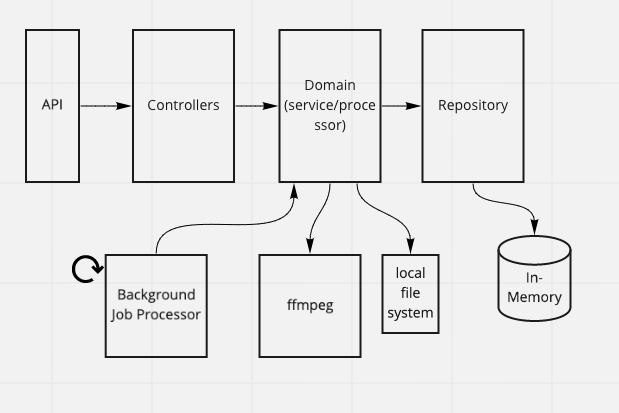

# Concatenate Videos

### Running the application
Dependencies:
ffmpeg (todo: run in docker container with ffmpeg installed to remove dependency on local installation)
```
brew install ffmpeg
```

Start the api and background job processor
```
npm start
```
api runs on port 8000


### API Call Flow
```
POST /jobs
{
    "sourceVideoUrls": ["<url to mp4>", "<url to another mp4>"]
    "destination:: {
        "directory": "<local path of directory that'll store merged file>"
    }
}
```
returns
```
{
    "id": "<job id>"
    "status": "<url to status of job>"
}
```

```
GET /job/{jobId}/status
```
returns
```
{
    "status": "pending"
}
```


### Architecture

Aimed for a lightweight onion architecture

#### TODO
- [ ] Tests!
- [ ] ffmpeg flakiness <- couldn't figure out why I was getting an occassional format error on the same source video urls
- [ ] host in docker to remove OS installed ffmpeg dependency
- [ ] move background job processor into seperate service 
- [ ] persistent storage
- [ ] error handling
- [ ] don't use destination directory for sourceVideoUrl download location
- [ ] clean up sourceVideos after merged video is produced
- [ ] configurable download directory (env variables)
- [ ] include merged file path in response